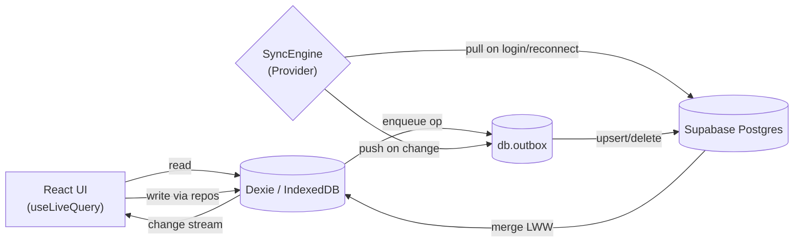
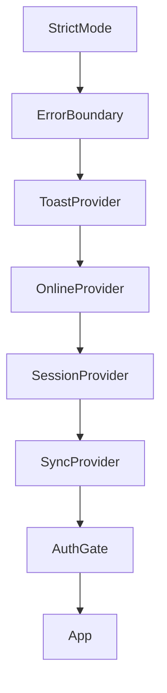
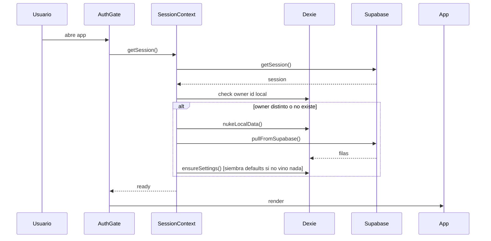

# Arquitectura — Fla MpM

## Vista de alto nivel
App PWA 100% client-side. Dexie/IndexedDB es fuente de verdad local. Supabase Postgres es respaldo/multi-dispositivo. Sin backend propio.

## Stack
- React 18
- Vite
- TypeScript (estricto)
- Dexie
- Supabase
- Vercel
- `@react-pdf/renderer`

## Patrones de diseño en el código
- **Repository**: 1 por entidad (`src/repositories/`). Aísla Dexie de la UI.
- **Outbox**: cambios locales encolados en `db.outbox`, empujados a Supabase cuando hay conexión + sesión. `src/sync/outbox.ts`.
- **Provider/Context**: SessionProvider, SyncProvider, ToastProvider, OnlineProvider, ErrorBoundary.
- **Domain / Pure Functions**: toda la lógica de negocio en `src/domain/` sin efectos secundarios. Fácil de testear.
- **Mapper**: camelCase (dominio) ↔ snake_case (Postgres). `src/sync/mappers.ts`.

## Diagrama: flujo de datos (Mermaid)

## Diagrama: providers de React (Mermaid)

## Diagrama: bootstrap de sesión (Mermaid)

## Estructura de carpetas
- `src/auth/`: Lógica de autenticación, pantalla de Login y SessionProvider.
- `src/components/`: Componentes UI reutilizables (`PaymentSheet`, `ClientDetailSheet`, `SettingsSheet`).
- `src/config/`: Valores por defecto del negocio y configuraciones (`business.ts`).
- `src/db/`: Inicialización de Dexie (`database.ts`), definiciones de tablas y lógica de local ownership.
- `src/domain/`: Lógica de negocio pura y testeada (reglas, validaciones, cálculos). Cero side-effects.
- `src/lib/`: Utilidades genéricas e infraestructura local (dinero, fechas, IDs).
- `src/pdf/`: Componentes generadores de PDF on-demand (`PaymentReceiptPdf`, `StatementPdf`).
- `src/repositories/`: Accesos a base de datos local Dexie (`clientsRepo`, `loansRepo`, etc.).
- `src/sync/`: Sincronización, Outbox pattern (`outbox.ts`), Engine y mappers Supabase.
- `src/types/`: Interfaces principales del negocio (`domain.ts`).
- `src/ui/`: Contextos globales UI (`ToastContext`), `ErrorBoundary`, hooks visuales (`useDailyBrief`).

## Sincronización — detalles
- Push: `SyncEngine` observa `db.outbox` con useLiveQuery; cuando `pendingCount > 0` + online + sesión, dispara `pushOutbox()`.
- Pull: solo en login inicial y al reconectar (no polling continuo).
- Conflictos: last-write-wins por `updatedAt`. Payments son inmutables (skip si id ya existe).
- Estado visible: chip en header (synced/syncing/offline/error). `src/App.tsx`.

## Errores y notificaciones
- ErrorBoundary captura throws no manejados y muestra pantalla de recuperación con "Reintentar" y "Recargar".
- Toasts: 3 tipos (success/error/info) con autodismiss 4s, o `persistent:true` para requerir cierre manual (usado por el daily brief).

## Autenticación
- Supabase Auth email+password.
- RLS en Postgres: cada tabla tiene policy `owner_id = auth.uid()`.
- LoginScreen si no hay sesión (prod). Dev bypass si `!isSupabaseConfigured`.

## PDFs
- `@react-pdf/renderer` con dynamic import → chunk lazy. Bundle inicial no crece.
- 2 componentes: `PaymentReceiptPdf` (post-cobro) y `StatementPdf` (por cliente).
